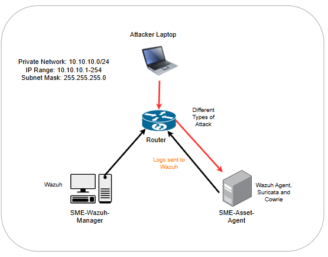
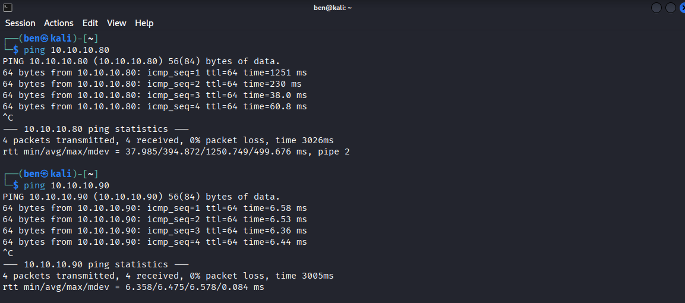
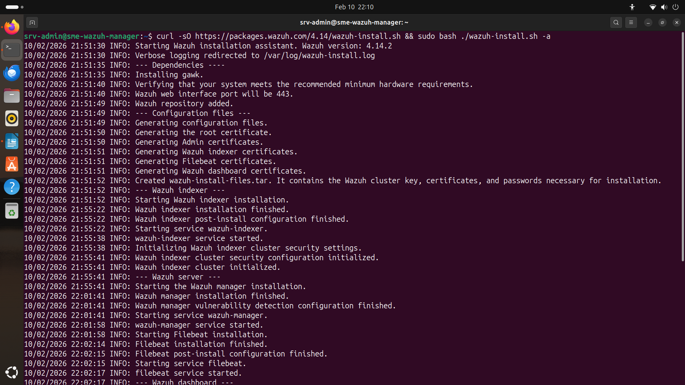
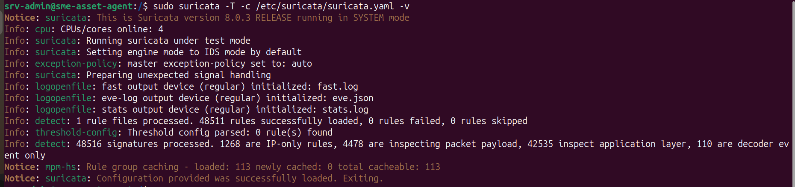
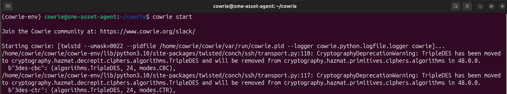

# Lab Environment & Architecture Setup

This section documents the hardware, network architecture, and security infrastructure used to build the isolated SME security laboratory.

The environment was designed to demonstrate that enterprise-grade security monitoring and threat detection can be implemented using open-source technologies and repurposed legacy hardware.

The lab provides the foundation for all subsequent attack scenarios documented within this repository.

## Overview

The laboratory simulates a constrained Small and Medium-sized Enterprise (SME) environment.

The architecture integrates multiple security layers:

* **Centralised Security Monitoring:** Wazuh
* **Host-Based Intrusion Detection:** Wazuh Agent
* **Network Intrusion Detection:** Suricata
* **Deception Technology:** Cowrie Honeypot
* **Kernel-Level Auditing:** auditd
* **File Integrity Monitoring:** Wazuh Whodata

All systems were deployed on a dedicated and physically isolated network to ensure that offensive security testing and malware simulations remained contained within the laboratory environment.

# Hardware Specifications

The lab relies on three primary physical machines configured on a localised and isolated network.

| Role                  | Device             | Hardware             | Operating System      | IP Address     |
| :-------------------- | :----------------- | :------------------- | :-------------------- | :------------- |
| **SME-Wazuh-Manager** | Dell OptiPlex 3050 | 16GB DDR4 (2400 MHz) | Ubuntu 24.04 Desktop  | `10.10.10.80`  |
| **SME-Asset-Agent**   | Dell OptiPlex 3040 | 16GB DDR3 (1600 MHz) | Ubuntu 22.04 Headless | `10.10.10.90`  |
| **Attacker**          | Lenovo Laptop      | 8GB DDR4 (2400 MHz)  | Kali Linux            | `10.10.10.100` |

The use of legacy hardware was intentional. The objective was to evaluate whether an effective security architecture could be deployed without requiring expensive enterprise infrastructure.

# Network Segmentation

To safely execute malware simulations and offensive security tools without exposing external networks, the laboratory was physically isolated using a dedicated TP-Link router.

The isolated network configuration is:

* **Subnet:** `10.10.10.0/24`
* **Gateway:** `10.10.10.1`

The physical isolation of the environment allows offensive activities such as:

* Network reconnaissance
* Port scanning
* Brute-force attacks
* Honeypot interaction
* Malware simulations
* File integrity modification testing

to be performed without affecting external systems or production infrastructure.



> **Note:** The logical network topology diagram demonstrates the routing of security telemetry from the monitored asset to the central Wazuh SIEM while keeping the attacker machine within the isolated laboratory environment.

# Step-by-Step Engineering & Deployment

The following sections document the deployment and integration process used to build the defence-in-depth architecture.

The completed environment combines endpoint monitoring, network intrusion detection, deception technology, kernel-level auditing, and centralised security monitoring.

## 1. Base Operating Systems & Network Verification

The monitored asset was built using **Ubuntu 22.04 Headless** to simulate an ageing production server while minimising unnecessary resource consumption.

The Wazuh Manager node was deployed using **Ubuntu 24.04 Desktop**, while the attacker machine utilised **Kali Linux**.

The systems were configured with the following addresses:

```text
Wazuh Manager:  10.10.10.80
SME Asset:      10.10.10.90
Attacker:       10.10.10.100
```

Before deploying the security infrastructure, network connectivity was verified across the `10.10.10.0/24` subnet using ICMP ping requests.

Example verification commands:

```bash
ping 10.10.10.80
ping 10.10.10.90
ping 10.10.10.100
```



Successful ICMP responses confirmed that the systems could communicate correctly before the deployment of the security monitoring tools.

# 2. Centralised SIEM Deployment: Wazuh Manager

The Wazuh Manager was installed on the machine with the following IP address:

```text
10.10.10.80
```

The Wazuh Manager acts as the central aggregation and correlation engine for the laboratory.

The platform provides the central location for:

* Log collection
* Security event correlation
* Alert generation
* File Integrity Monitoring
* Host-based intrusion detection
* Vulnerability detection
* Active Response
* Security event investigation

The Wazuh installation assistant was used to deploy the central components.

```bash
# Wazuh Manager installation via installation assistant
curl -sO https://packages.wazuh.com/4.14/wazuh-install.sh && sudo bash ./wazuh-install.sh -a
```



Following installation, the Wazuh Dashboard provides centralised visibility into security events generated by the monitored asset and integrated detection technologies.

# 3. Endpoint Monitoring: Wazuh Agent

To monitor the SME asset, the Wazuh Agent was installed on the Ubuntu 22.04 Headless system.

The agent was configured to communicate with the central Wazuh Manager at:

```text
10.10.10.80
```

The Wazuh repository was configured using:

```bash
# Adding the repository
echo "deb [signed-by=/usr/share/keyrings/wazuh.gpg] https://packages.wazuh.com/4.x/apt/ stable main" | sudo tee /etc/apt/sources.list.d/wazuh.list
```

The Wazuh Agent was then installed and configured to communicate with the manager:

```bash
sudo WAZUH_MANAGER='10.10.10.80' apt-get install wazuh-agent
```

The service was enabled to automatically start during system boot:

```bash
sudo systemctl enable wazuh-agent
sudo systemctl start wazuh-agent
```

The status of the service can be verified using:

```bash
sudo systemctl status wazuh-agent
```


Once connected, the Wazuh Agent forwards endpoint telemetry and security events to the central SIEM.

This endpoint visibility provides the foundation for several of the attack detection scenarios demonstrated later in the project.

# 4. Network Detection Integration: Suricata NIDS

Suricata was selected as the Network Intrusion Detection System (NIDS).

It was chosen over Snort due to its multi-threaded architecture, which allows efficient packet inspection and detection capabilities on constrained legacy hardware.

Suricata provides visibility into network activity and can detect suspicious traffic using configured detection rules.

The installation began by adding the OISF stable repository.

```bash
# Adding the PPA and installing Suricata
sudo add-apt-repository ppa:oisf/suricata-stable
sudo apt-get update
sudo apt install suricata
```

The Emerging Threats Open ruleset was then downloaded and updated.

```bash
# Fetching the ET/Open Ruleset
sudo suricata-update
```

Before deploying Suricata for live monitoring, the configuration was tested.

```bash
# Verifying configuration integrity before live deployment
sudo suricata -T -c /etc/suricata/suricata.yaml -v
```



Successful configuration validation confirmed that Suricata could load its configuration and detection rules correctly.

Suricata forms the primary network detection layer used in the reconnaissance scenario documented later in this repository.

# 5. Deception Layer: Cowrie Honeypot

Cowrie was deployed as the deception technology layer within the security architecture.

The honeypot was configured to intercept malicious SSH activity and collect intelligence about attacker behaviour.

Cowrie allows the environment to capture:

* Brute-force attempts
* Attempted usernames
* Attempted passwords
* Source IP addresses
* Commands executed by attackers
* Post-exploitation activity
* File download attempts

To isolate the Cowrie installation and its dependencies from the underlying operating system, it was deployed within a Python virtual environment.

The Cowrie repository was cloned using:

```bash
# Cloning the repository
git clone https://github.com/cowrie/cowrie
```

A Python virtual environment was then created:

```bash
python3 -m venv cowrie-env
source cowrie-env/bin/activate
```

The required dependencies were installed:

```bash
pip install --upgrade pip
pip install --upgrade -r requirements.txt
```

The deception service was then started:

```bash
cowrie start
```



The Cowrie honeypot provides an additional layer of visibility by recording attacker interactions within a controlled environment.

The collected activity is later used in the honeypot and brute-force attack scenarios.

# 6. Kernel-Level Auditing: auditd

To support high-fidelity File Integrity Monitoring, the Linux Auditing System (`auditd`) was installed on the monitored asset.

The integration with Wazuh allows the File Integrity Monitoring module to provide **Whodata** information.

Whodata provides additional context when files are modified, allowing security analysts to investigate not only that a file changed but potentially:

* Which user performed the modification
* Which process was responsible
* When the modification occurred
* Additional information surrounding the event

The required auditing packages were installed using:

```bash
# Installing the kernel auditing package
sudo apt-get install auditd audispd-plugins
```

The auditing service was enabled and started:

```bash
sudo systemctl enable auditd
sudo systemctl start auditd
```

The service status can be verified using:

```bash
sudo systemctl status auditd
```

The `auditd` integration forms the foundation for the File Integrity Monitoring scenario demonstrated later in this project.

# Defence-in-Depth Architecture

The completed laboratory environment combines several complementary security technologies.

| Security Layer                      | Technology    | Primary Function                                      |
| :---------------------------------- | :------------ | :---------------------------------------------------- |
| **Centralised Security Monitoring** | Wazuh Manager | Aggregation and correlation of security events        |
| **Endpoint Monitoring**             | Wazuh Agent   | Collection of endpoint security telemetry             |
| **Network Intrusion Detection**     | Suricata      | Detection of suspicious network activity              |
| **Deception Technology**            | Cowrie        | Capturing attacker behaviour and brute-force activity |
| **Kernel-Level Auditing**           | auditd        | Detailed Linux auditing                               |
| **File Integrity Monitoring**       | Wazuh FIM     | Detecting unauthorised file modifications             |

The architecture provides multiple layers of security visibility rather than relying on a single defensive control.

# Security Telemetry Flow

The general flow of activity within the laboratory is illustrated below:

```text
                         ┌─────────────────────┐
                         │      ATTACKER       │
                         │    Kali Linux       │
                         │   10.10.10.100      │
                         └──────────┬──────────┘
                                    │
                                    │
                                    ▼
                    ┌──────────────────────────────┐
                    │     ISOLATED SME NETWORK     │
                    │        10.10.10.0/24         │
                    └──────────────┬───────────────┘
                                   │
                 ┌─────────────────┴─────────────────┐
                 │                                   │
                 ▼                                   ▼
      ┌──────────────────────┐           ┌──────────────────────┐
      │   SURICATA NIDS      │           │   COWRIE HONEYPOT    │
      │ Network Detection    │           │ Deception Technology │
      └──────────┬───────────┘           └──────────┬───────────┘
                 │                                   │
                 └─────────────────┬─────────────────┘
                                   │
                                   ▼
                        ┌──────────────────────┐
                        │      SME ASSET       │
                        │     10.10.10.90      │
                        │                      │
                        │   Wazuh Agent        │
                        │   auditd             │
                        │   File Integrity     │
                        │   Monitoring         │
                        └──────────┬───────────┘
                                   │
                                   │ Security Telemetry
                                   ▼
                        ┌──────────────────────┐
                        │    WAZUH MANAGER     │
                        │     10.10.10.80      │
                        │                      │
                        │ SIEM / Correlation   │
                        │ Alerting / Response  │
                        └──────────────────────┘
```

---

# Deployment Outcome

The successful deployment of the laboratory created an isolated security environment capable of supporting:

* Centralised security monitoring
* Endpoint telemetry collection
* Network intrusion detection
* Honeypot monitoring
* Brute-force attack detection
* File Integrity Monitoring
* Kernel-level auditing
* Malware detection testing
* Automated incident response
* Security event investigation

The completed environment forms the foundation for the remaining attack and defence scenarios within this repository.

# Next Steps

With the infrastructure successfully deployed, the following scenarios demonstrate how the integrated security controls detect and respond to simulated attacker activity.

Continue to:

* [02_Scenario_A_Reconnaissance](../02_Scenario_A_Reconnaissance)
* [03_Scenario_B_Deception_Honeypot](../03_Scenario_B_Deception_Honeypot)
* [04_Scenario_C_Brute_Force](../04_Scenario_C_Brute_Force)
* [05_Scenario_D_File_Integrity](../05_Scenario_D_File_Integrity)
* [06_Scenario_E_Malware_Drop](../06_Scenario_E_Malware_Drop)
