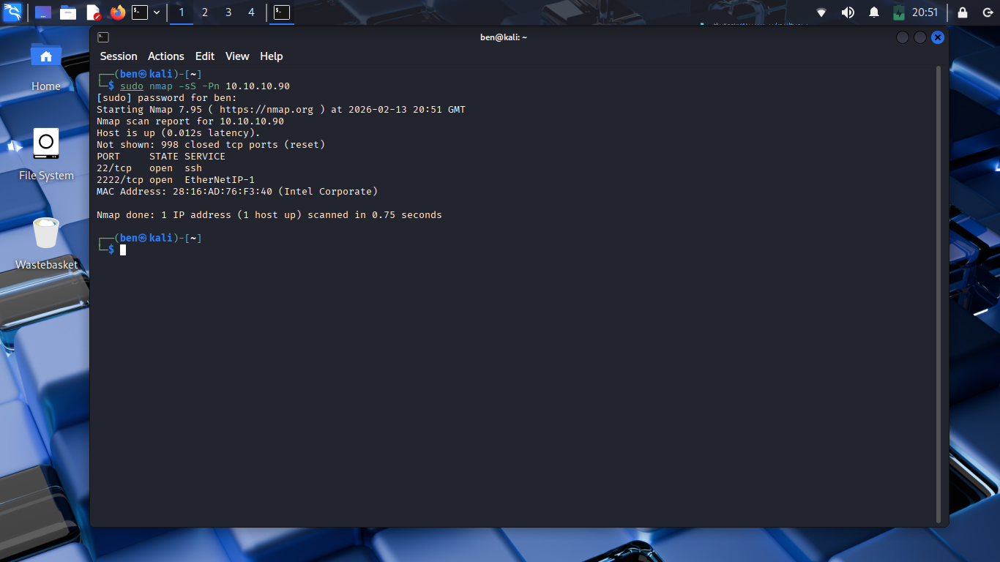
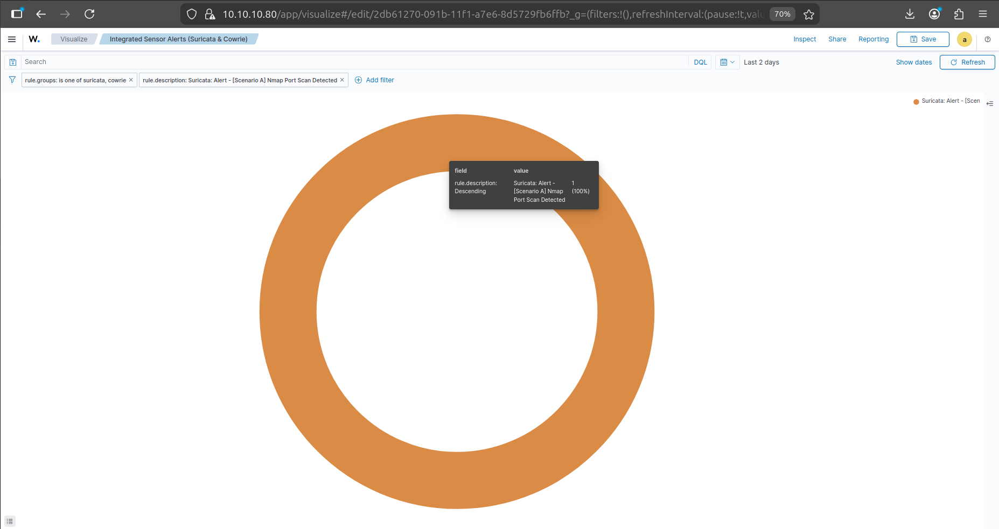
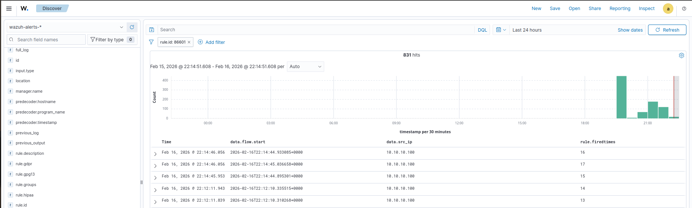

# Scenario A: Network Reconnaissance (Nmap Port Scan)

This scenario represents the reconnaissance and network enumeration stage of the cyber kill chain.

Before an attacker attempts exploitation, they will often perform reconnaissance to identify active hosts, open ports, exposed services, and potential entry points. This scenario evaluates whether the security architecture can detect and log active network mapping attempts in near real time.

The test demonstrates the integration between:

* **Kali Linux** as the attacker platform
* **Nmap** for network reconnaissance
* **Suricata** for network intrusion detection
* **Wazuh** for centralised security monitoring and alert correlation

# Scenario Objective

The objective of this scenario was to determine whether the SME security architecture could:

1. Detect an active Nmap port scan.
2. Generate a Suricata alert using a custom detection rule.
3. Record the event in Suricata's EVE JSON logs.
4. Forward the detection telemetry to Wazuh.
5. Generate a centralised security alert.
6. Measure the time required to detect the reconnaissance activity.

This scenario focuses on detecting malicious network enumeration before an attacker progresses to exploitation.

# Attack Scenario

The attack was performed from the Kali Linux attacker machine against the monitored SME asset.

| System         | Role     | IP Address     |
| :------------- | :------- | :------------- |
| **Kali Linux** | Attacker | `10.10.10.100` |
| **SME Asset**  | Target   | `10.10.10.90`  |

The attack was performed entirely within the isolated laboratory network:

```text id="avwnt3"
10.10.10.0/24
```

# Attack Execution

From the Kali Linux attacker machine (`10.10.10.100`), an Nmap SYN scan was executed against the SME asset (`10.10.10.90`).

The scan used:

* `-sS` — TCP SYN scan
* `-Pn` — Skip host discovery and treat the target as online

The command was executed from the Kali Linux attacker machine:

```bash id="qmeoqf"
sudo nmap -sS -Pn 10.10.10.90
```

A SYN scan is commonly used during reconnaissance because it allows an attacker to determine which TCP ports are open without completing a full TCP connection.

During the scan, Nmap probes the target for accessible services and identifies ports that may represent potential entry points.

The reconnaissance activity identified exposed services, including:

* SSH on Port `22`
* Administrative SSH on Port `2222`


>  Kali Linux executing a SYN scan against the SME asset to identify exposed network services.

# Detection & Telemetry

## Suricata Network Intrusion Detection

As the attacker performed reconnaissance against the SME asset, Suricata monitored the network traffic.

Suricata operates as the Network Intrusion Detection System (NIDS) within the security architecture and inspects traffic for suspicious patterns.

The reconnaissance activity generated multiple TCP SYN packets directed from:

```text id="8zt1p9"
Source:      10.10.10.100
Destination: 10.10.10.90
```

The repeated SYN packets were evaluated against Suricata's detection rules.

# Custom Suricata Detection Rule

To detect the reconnaissance activity without generating excessive alerts, a custom detection rule was added to the Suricata local ruleset.

The rule was stored in:

```text id="lktfg2"
/etc/suricata/rules/local.rules
```

The custom rule was:

```text id="jifh1v"
alert tcp 10.10.10.100 any -> 10.10.10.90 any (msg:"[Scenario A] Nmap Port Scan Detected"; flags:S; threshold: type both, track by_src, count 5, seconds 30; sid:100001; rev:1;)
```

## Rule Breakdown

The detection rule contains several important components.

| Rule Component | Purpose                                             |
| :------------- | :-------------------------------------------------- |
| `alert`        | Generates an alert when the rule conditions are met |
| `tcp`          | Inspects TCP traffic                                |
| `10.10.10.100` | Specifies the attacker IP address                   |
| `any`          | Allows traffic from any source port                 |
| `10.10.10.90`  | Specifies the target SME asset                      |
| `flags:S`      | Detects TCP packets with the SYN flag set           |
| `threshold`    | Prevents excessive alert generation                 |
| `track by_src` | Tracks activity based on the source IP address      |
| `count 5`      | Requires five matching events                       |
| `seconds 30`   | Evaluates the threshold over a 30-second period     |
| `sid:100001`   | Unique Suricata rule identifier                     |
| `rev:1`        | Rule revision number                                |

The threshold configuration was included to reduce alert fatigue.

Rather than generating an alert for every SYN packet, Suricata generates a detection when repeated SYN activity reaches the configured threshold.

# Detection Flow

The security telemetry generated during the reconnaissance attack follows the path below:

```text id="qqze9w"
┌──────────────────────────────┐
│           ATTACKER           │
│         Kali Linux           │
│        10.10.10.100          │
└──────────────┬───────────────┘
               │
               │ Nmap SYN Scan
               │
               ▼
┌──────────────────────────────┐
│          SME ASSET           │
│         10.10.10.90          │
│                              │
│      Suricata Monitoring     │
└──────────────┬───────────────┘
               │
               │ Suricata Alert
               ▼
┌──────────────────────────────┐
│        EVE JSON LOGS         │
│        /eve.json             │
└──────────────┬───────────────┘
               │
               │ Security Telemetry
               ▼
┌──────────────────────────────┐
│         WAZUH AGENT          │
│                              │
│      Log Collection          │
└──────────────┬───────────────┘
               │
               │ Forwarded Events
               ▼
┌──────────────────────────────┐
│        WAZUH MANAGER         │
│        10.10.10.80           │
│                              │
│   Correlation & Alerting     │
└──────────────────────────────┘
```

# SIEM Correlation & Dashboard Visualisation

When Suricata detected the reconnaissance pattern, the alert was written to the EVE JSON log file.

Suricata uses the Extensible JSON Event format to record network security events.

The events are stored within:

```text id="a1ltb4"
/var/log/suricata/eve.json
```

The Wazuh Agent monitors the relevant Suricata log output and forwards the security telemetry to the Wazuh Manager.

The central Wazuh platform then processes and correlates the event.

This allows the reconnaissance activity to be investigated through the SIEM rather than requiring direct analysis of the Suricata sensor.


>  The Wazuh dashboard successfully detecting and classifying the Nmap port scan as a network security alert.

# Performance Metrics - Mean Time to Detect (MTTD)

The Mean Time to Detect (MTTD) was measured to determine how quickly the architecture detected network reconnaissance activity.

The measurement compares:

1. The initial network flow start time.
2. The time at which the security alert was generated.

The detection lag was calculated using:

```text id="f58dne"
Detection Lag = Alert Time - Flow Start Time
```

## Detection Measurements

| Test | Alert Time     | Flow Start Time | Detection Lag     |
| :--- | :------------- | :-------------- | :---------------- |
| 1    | `22:14:46.056` | `22:14:44.933`  | **1.123 seconds** |
| 2    | `22:14:46.056` | `22:14:45.036`  | **1.020 seconds** |
| 3    | `22:14:45.953` | `22:14:44.895`  | **1.058 seconds** |
| 4    | `22:14:11.943` | `22:14:10.335`  | **1.608 seconds** |
| 5    | `22:14:11.839` | `22:14:10.310`  | **1.529 seconds** |


>  Empirical log timestamps extracted from Wazuh/Suricata demonstrating the millisecond-level calculation behind the 1.27 seconds average Mean Time to Detect.

## Average Mean Time to Detect

The five detection measurements were used to calculate the average Mean Time to Detect.

```text id="grggrt"
1.123 + 1.020 + 1.058 + 1.608 + 1.529
───────────────────────────────────────
                    5
```

### Average MTTD

# **1.27 seconds**

# Performance Verdict

The architecture achieved an average Mean Time to Detect of:

> ## **1.27 seconds**

This demonstrates near real-time detection of network reconnaissance activity.

Despite operating on repurposed legacy hardware, the integrated Suricata and Wazuh architecture successfully detected and centralised Nmap reconnaissance activity with a detection time significantly below one minute.

The results demonstrate that effective network visibility and rapid threat detection can be achieved using open-source security technologies within a resource-constrained SME environment.

# Next Steps

The reconnaissance scenario demonstrated that the security architecture can detect active network mapping attempts before an attacker progresses to exploitation.

Continue to:

* [**← Return to Lab Setup**](../01_Lab_Setup)
* [**Proceed to Scenario B: Deception Layer (Cowrie Honeypot) →**](../03_Scenario_B_Deception_Honeypot)
