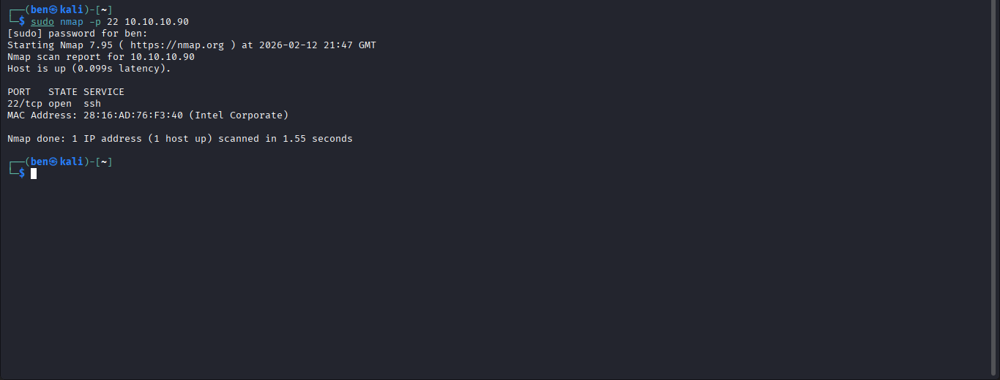
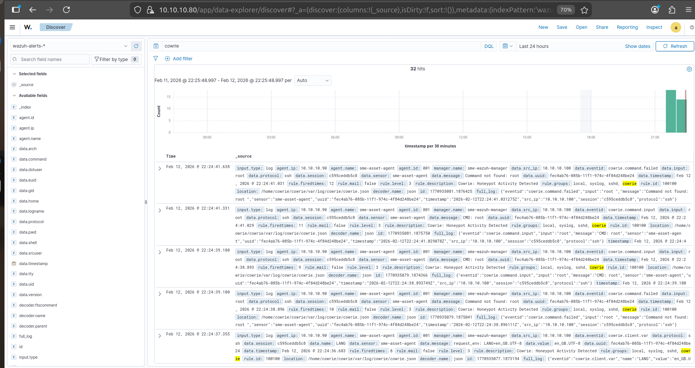

# Scenario B: Deception Technology & Honeypot Interaction (Cowrie)

This scenario introduces **deception technology** into the SME security architecture by deploying the **Cowrie SSH Honeypot** to intercept malicious activity, capture attacker credentials, and feed threat intelligence into the central **Wazuh SIEM**.

## Architecture & Port Redirection Strategy

To ensure the deception mechanisms did not interfere with legitimate administrative workflows, a **port separation strategy** was implemented on the SME asset (`10.10.10.90`):

* **Administrative SSH:** Moved to port `2222` for authorised system administration.
* **Cowrie Honeypot:** Configured internally on port `2223`.
* **Network Redirection:** Inbound traffic targeting the standard SSH port `22` is transparently redirected via `iptables` into the Cowrie honeypot.

### Port Configuration

| Service            |   Port | Purpose                               |
| ------------------ | -----: | ------------------------------------- |
| Standard SSH       |   `22` | External attack/deception entry point |
| Administrative SSH | `2222` | Legitimate system administration      |
| Cowrie Honeypot    | `2223` | Deception environment                 |

### Port 22 → Cowrie Redirection

```bash
# iptables rule redirecting inbound port 22 traffic to the Cowrie honeypot (port 2223)
sudo iptables -t nat -A PREROUTING -p tcp --dport 22 -j REDIRECT --to-port 2223
```

This configuration allows attackers targeting the conventional SSH port to interact with Cowrie without exposing the legitimate administrative SSH service.

## Attack Execution & Deception Interaction

From the **Kali Linux attacker machine** (`10.10.10.100`), an attack was launched against the target asset's standard SSH port.

### SSH Connection Attempt

```bash
# Attacker attempting an SSH connection to the perceived production server
ssh root@10.10.10.90
```


> **Figure B.1:** The Kali Linux attacker successfully connects to port `22`, unaware that the connection has been transparently redirected into the Cowrie deception environment.

The attacker therefore believes they are interacting with the production SSH service, while the actual interaction is being handled by the honeypot.

## Detection & Telemetry Integration

Cowrie generates structured JSON event logs through `cowrie.json`. These events record attacker activity and metadata, including:

* Source IP addresses
* Attempted usernames
* Attempted passwords
* Commands executed within the honeypot
* SSH connection events
* Session activity

The **Wazuh Agent** monitors the Cowrie log files and forwards the telemetry to the central **Wazuh Manager**, where the events can be correlated, analysed, and used for real-time alerting.

### Telemetry Flow

```text
Kali Linux Attacker
        │
        │ SSH → TCP/22
        ▼
SME Asset (10.10.10.90)
        │
        │ iptables REDIRECT
        ▼
Cowrie Honeypot (TCP/2223)
        │
        │ cowrie.json
        ▼
Wazuh Agent
        │
        │ Log Forwarding
        ▼
Wazuh Manager / SIEM
        │
        ▼
Detection & Alerting
```
### Wazuh Agent Log Collection Configuration

To capture Cowrie's structured output, the local Wazuh agent configuration file (`/var/ossec/etc/ossec.conf`) was updated to monitor the JSON log path:

```xml
<ossec_config>
  <localfile>
    <log_format>json</log_format>
    <location>/home/cowrie/cowrie/var/log/cowrie/cowrie.json</location>
  </localfile>
</ossec_config>
```
Once configured, the Wazuh agent dynamically reads each security event, forwards it to the manager, and normalizes the attributes for SIEM visualization:


> **Figure B.2:** Raw Cowrie event logs successfully ingested and indexed by the Wazuh SIEM, demonstrating attacker activity tracking and metadata extraction.

## Performance Metrics: Mean Time to Detect (MTTD)

Detection performance was evaluated by comparing the **attack start timestamp** against the **SIEM alert generation timestamp**.

The detection lag was calculated using:

```text
Detection Lag = Alert Time - Attack Start Time
```

### MTTD Results

|  Test | Incident Type       | Attack Start (`Tstart`) | Alert Time (`Tdetect`) | Detection Lag (MTTD) |
| ----: | ------------------- | ----------------------- | ---------------------- | -------------------: |
| **1** | Honeypot Connection | `22:38:10.000`          | `22:38:12.019`         |    **2.019 seconds** |
| **2** | Honeypot Connection | `22:38:29.000`          | `22:38:30.174`         |    **1.174 seconds** |
| **3** | Honeypot Connection | `22:40:24.000`          | `22:40:26.163`         |    **2.163 seconds** |
| **4** | Honeypot Connection | `22:40:25.000`          | `22:40:26.272`         |    **1.272 seconds** |
| **5** | Honeypot Connection | `22:40:26.000`          | `22:40:28.313`         |    **2.313 seconds** |

### Results

* **Average MTTD:** **1.81 seconds**
* **Verdict:** **Superior** threat intelligence generation speed, with attackers interacting with the deception layer being detected in near real time.

The results demonstrate that the Cowrie → Wazuh integration provides rapid visibility into malicious SSH activity, allowing suspicious interactions to be identified shortly after they occur.

## Security Capabilities Summary

| Security Capability                  | Implementation Result                               |
| ------------------------------------ | --------------------------------------------------- |
| **SSH Traffic Redirection**          | Successfully redirected port `22` traffic to Cowrie |
| **Legitimate Administrative Access** | Preserved securely on port `2222`                   |
| **Credential & Command Capture**     | Successfully logged attempted brute-force patterns  |
| **Centralised Telemetry**            | Automated ingestion into Wazuh SIEM                 |
| **Average MTTD**                     | **1.81 seconds** — near real-time detection         |

## Security Outcome

The implementation successfully demonstrated how **deception technology can be integrated into an SME security architecture without disrupting legitimate administration**.

The combination of **iptables port redirection, Cowrie honeypot telemetry, Wazuh Agent log collection, and centralised SIEM alerting** created an additional detection layer capable of:

1. Attracting attackers targeting the standard SSH service.
2. Preventing direct interaction with the legitimate administrative SSH service.
3. Capturing attacker credentials and commands.
4. Generating structured security telemetry.
5. Forwarding events to the central Wazuh SIEM.
6. Detecting malicious interaction with an average MTTD of **1.81 seconds**.

This demonstrates the value of deception technology as a **low-cost additional detection capability for SME environments**.

## Next Steps

* [**← Return to Scenario A: Network Reconnaissance**](../02_Scenario_A_Reconnaissance)
* [**Proceed to Scenario C: Brute-Force & Active Response Countermeasures →**](../04_Scenario_C_Brute_Force)
