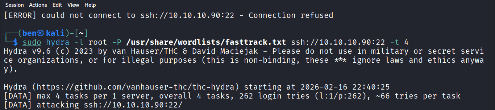
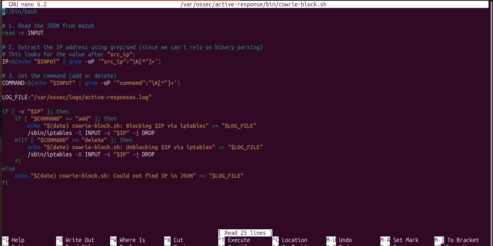
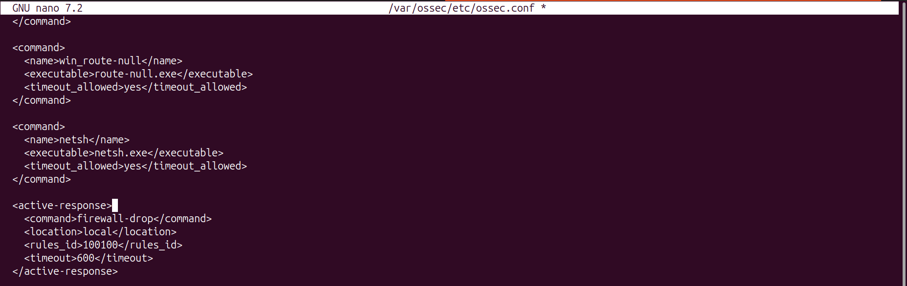
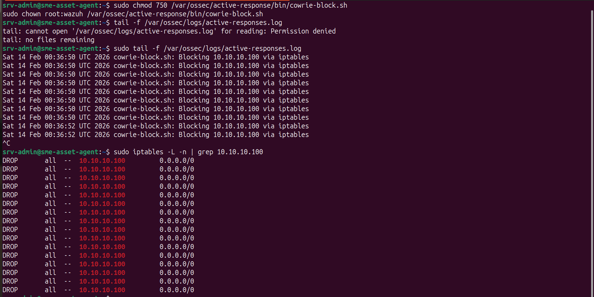
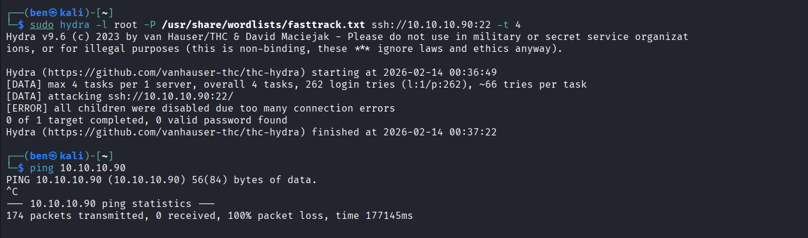

# Scenario C: Brute-Force Exploitation & Active Response

While deception technology (Scenario B) handles untargeted attacks on default ports, sophisticated adversaries may locate and target the legitimate administrative SSH service (Port `2222`).

This scenario evaluates the architecture's ability to not only detect a credential brute-force attack but to **automatically contain the threat** using Wazuh's Active Response capabilities before the attacker can successfully authenticate.

## Attack Execution

From the Kali Linux attacker machine (`10.10.10.100`), a dictionary-based brute-force attack was launched against the SME asset's administrative SSH port using THC-Hydra and the `fasttrack.txt` wordlist.

```bash
# Executing a brute-force attack against the administrative SSH port
hydra -l srv-admin -P /usr/share/wordlists/fasttrack ssh://10.10.10.90:22 -t 4
````

> The Kali Linux attacker aggressively cycling through credentials in an attempt to breach the administrative SSH service.

## Detection & Automated Containment

The Wazuh agent actively monitors system authentication logs. However, to actively stop the threat, the SIEM was configured to execute a custom **Active Response (AR)** script upon detecting the brute-force threshold.

### 1. The Custom Enforcement Script


A custom bash script (`cowrie-block.sh`) was engineered to parse the JSON alert data from Wazuh, extract the attacker's IP address, and dynamically inject a `DROP` rule into the local `iptables` firewall.


> The custom Active Response bash script designed to act as the enforcement officer, routing malicious IPs to `iptables`.

### 2. Wazuh Configuration (`ossec.conf`)

The Wazuh manager was configured to trigger this specific response whenever a high-severity brute-force rule (e.g., Rule ID `100100`) was tripped.


> The `<active-response>` block inside `ossec.conf` linking the detection rule to the firewall-drop executable.

### 3. Verifying the Block (Defender & Attacker Perspectives)

When the Hydra attack breached the threshold, the Active Response fired immediately. The logs on the defender's asset confirmed the IP `10.10.10.100` was routed to `iptables`.


> The defender's asset terminal verifying the Active Response log and confirming the `DROP` rules were successfully injected into `iptables`.

From the attacker's perspective, the connection was abruptly severed. Hydra failed due to connection errors, and a subsequent ping to the target resulted in 100% packet loss, confirming total network isolation.


> The Kali Linux terminal showing the brute-force tool failing and all subsequent network traffic (ICMP pings) being dropped by the target.

## Next Steps

* [**← Return to Scenario B: Deception Technology**](../03_Scenario_B_Deception_Honeypot)
* [**Proceed to Scenario D: File Integrity Monitoring (FIM) →**](../05_Scenario_D_File_Integrity)
