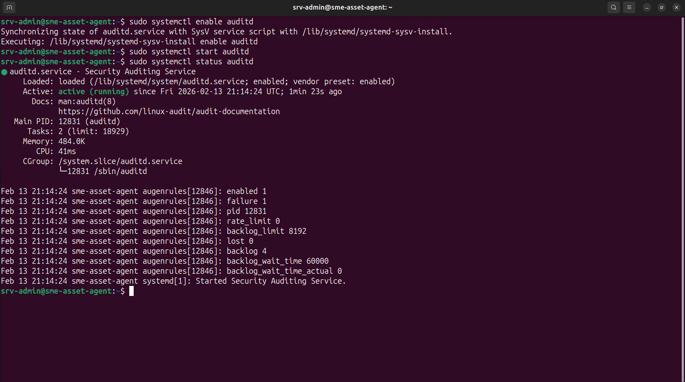

# Scenario D: Post-Exploitation & File Integrity Monitoring (FIM)

If an attacker successfully breaches the perimeter and gains access to the system, their next objective in the cyber kill chain is usually establishing persistence or elevating privileges. This often involves modifying critical system files, such as `/etc/passwd`, SSH keys, or application configurations.

This scenario evaluates the architecture's internal defense layer by configuring **Wazuh's File Integrity Monitoring (FIM) module (Syscheck)** in tandem with Linux `auditd`. This combination not only detects file modifications in real-time but provides kernel-level user attribution (Who-Data).

## Engineering the FIM Pipeline (Auditd & Syscheck)

To capture exactly *who* modified a file and *what process* was used, basic file hashing is insufficient. The Wazuh agent was integrated with the Linux kernel's audit daemon (`auditd`).

### 1. Installing and Enabling Auditd

The `auditd` package was installed and enabled on the target SME asset to hook into kernel-level file system events.


> Installing the `auditd` package on the target Ubuntu asset.



> Verifying that the Security Auditing Service is actively running and tracking kernel events.

### 2. Wazuh Syscheck Configuration

With the kernel auditor running, the Wazuh agent's configuration file (`/var/ossec/etc/ossec.conf`) was updated. The `<syscheck>` block was configured to monitor critical directories (like `/etc` and `/bin`) with both `realtime="yes"` and `whodata="yes"`.


> The `ossec.conf` file showing the directories being monitored in real-time with user attribution (whodata) enabled.

## Attack Execution: Unauthorised File Modification

To simulate post-exploitation activity, an attacker attempts to modify a critical monitored file on the SME asset to establish a backdoor or escalate privileges. Based on the resulting telemetry, a modification was made to `/etc/passwd` using the `/usr/bin/tee` process.

```bash
# Example simulation of an attacker appending a backdoor user to /etc/passwd
echo "backdoor:x:0:0::/root:/bin/bash" | sudo tee -a /etc/passwd
```
## Detection & Telemetry Analysis

Because syscheck was actively monitoring the /etc/ directory, the modification was immediately intercepted.

1. SIEM Alerting

The Wazuh Manager successfully flagged the modification, generating a Rule ID 550 (Integrity checksum changed) alert.


> The Wazuh dashboard confirming FIM is fully functional, showing high-severity alerts for modifications to /etc/passwd.

2. Deep Telemetry & User Attribution

Because auditd was successfully integrated, the alert contained profound forensic detail. It did not just show that the file changed, but exactly how it changed.


> The Wazuh event dashboard detailing the exact cryptographic hash changes (MD5, SHA1, SHA256) and size differences before and after the modification.


> The raw JSON alert payload demonstrating successful "whodata" extraction. It successfully tracked the specific login user (srv-admin), the effective elevated user (root), and the exact process used (/usr/bin/tee).

## Security Capabilities Summary

Security Capability	Implementation Result
Baseline Cryptographic Hashing	SHA1/SHA256/MD5 hashes successfully tracked before and after the event.
Real-Time Modification Detection	Wazuh Syscheck successfully flagged the unauthorized edit instantaneously.
Kernel-Level Auditing (Whodata)	auditd successfully tracked the user (srv-admin → root) and process (tee).
Post-Exploitation Visibility	Achieved comprehensive tracking of internal attacker actions for incident response.

## Next Steps
← Return to Scenario C: Brute-Force & Active Response
Proceed to Scenario E: Malware Drop & Vulnerability Detection →
